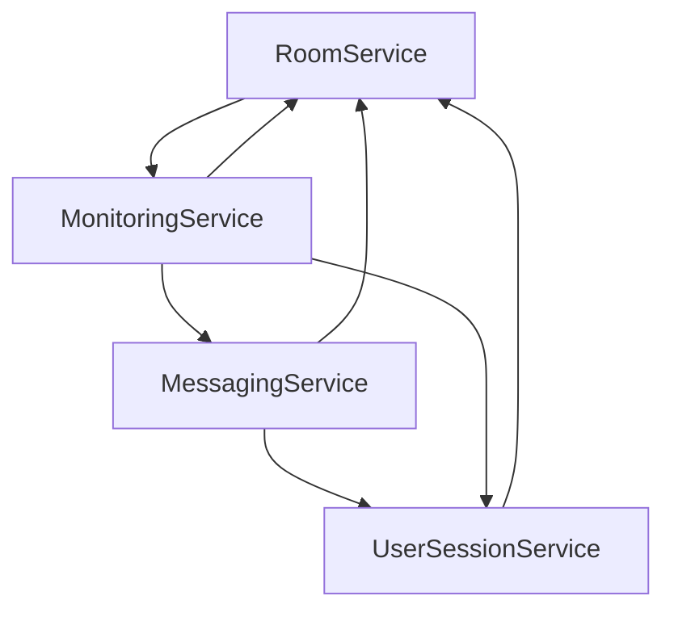

# AnonymousChatRoom - Features 總結

## 整體架構概覽
基於 .NET 8 + SignalR + PostgreSQL + Redis 的匿名即時聊天室系統，採用 Features 為導向的單體架構設計，為未來微服務化做準備。

---

## Feature 1: RoomService (房間服務)
> **核心職責**: 房間生命週期管理與用戶關係維護

### SubFeatures:
#### 1.1 RoomCreation (房間創建)
- 開房功能
- 房間配置設定 (密碼、名稱、人數上限)
- 房主身份建立
- 房間唯一識別碼生成

#### 1.2 RoomConfiguration (房間配置管理)
- 房間設定修改 (房主權限)
- 密碼驗證機制
- 人數限制控制
- 房間名稱管理

#### 1.3 ParticipantManagement (參與者管理)
- 用戶進房處理
- 用戶離房處理  
- 房間內用戶列表維護
- 房主轉移機制

#### 1.4 RoomLifecycle (房間生命週期)
- 空房間自動銷毀
- 房間狀態監控
- 房間統計資訊
- 房間分享連結生成

### Entity (需持久資料) 構思
- 房間主體資料
- 房間參與者們的資料(這個房間有哪些用戶)
---

## Feature 2: UserSessionService (用戶會話服務)
> **核心職責**: 匿名用戶識別與連線狀態管理

### SubFeatures:
#### 2.1 UserIdentification (用戶識別)
- 基於瀏覽器的匿名用戶識別
- 用戶唯一 ID 生成與維護
- 同設備同瀏覽器識別邏輯

#### 2.2 ConnectionManagement (連線管理)
- WebSocket 連線建立
- 連線狀態追蹤
- 斷線檢測與處理
- 連線到用戶映射

#### 2.3 ReconnectionHandling (重連處理)
- 斷線自動重連
- 連線狀態恢復
- 多房間狀態同步
- 連線失效清理

#### 2.4 MultiRoomSession (多房間會話)
- 單用戶多房間同時存在
- 跨房間狀態查詢
- 用戶當前房間列表維護

### Entity (需持久資料) 構思
- 用戶資料本體
- 用戶WebSocket連線
- 用戶參與房間狀況(這個用戶在哪些房間)
---

## Feature 3: MessagingService (訊息服務)
> **核心職責**: 即時訊息傳遞與歷史管理

### SubFeatures:
#### 3.1 RealTimeMessaging (即時訊息)
- SignalR Hub 管理
- 訊息即時廣播
- 房間內訊息分發
- 訊息格式驗證

#### 3.2 MessagePersistence (訊息持久化)
- 訊息資料庫存儲
- 訊息內容處理
- 訊息時間戳管理
- 訊息來源追蹤

#### 3.3 HistoryQuery (歷史查詢)
- 房間歷史訊息查詢
- 分頁載入機制
- 訊息搜尋功能
- 查詢權限控制

#### 3.4 MessageValidation (訊息驗證)
- 文字內容過濾(暫緩)
- 訊息長度限制(暫緩)
- 頻率限制控制(暫緩)
- 惡意內容檢測(暫緩)
- 
### Entity (需持久資料) 構思
- 訊息資料本體
---

## Feature 4: MonitoringService (監控服務)
> **核心職責**: 系統監控與統計資料收集

### SubFeatures:
#### 4.1 OnlineStatistics (在線統計)
- 即時在線人數統計
- 房間人數統計
- 用戶活躍度追蹤
- 統計資料快取

#### 4.2 SystemHealth (系統健康)
- PostgreSQL 健康檢查
- Redis 健康檢查
- 應用程式狀態監控
- 資源使用情況追蹤

#### 4.3 RoomMonitoring (房間監控)
- 房間活躍度監控
- 異常房間檢測
- 房間使用統計
- 自動清理觸發

#### 4.4 PerformanceMetrics (效能指標)
- API 回應時間統計
- SignalR 連線效能
- 資料庫查詢效能
- 系統負載監控

---

## 跨 Feature 整合點

### 服務間協作關係:

### 共用基礎設施:
- **PostgreSQL**: 所有 Feature 的主要資料存儲
- **Redis**: 快取、統計資料、SignalR Backplane
- **Serilog**: 統一日誌記錄
- **MediatR**: Commands/Queries 處理
- **Health Checks**: 跨服務健康監控
